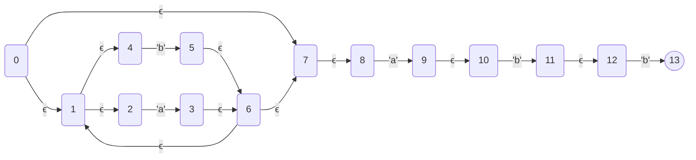
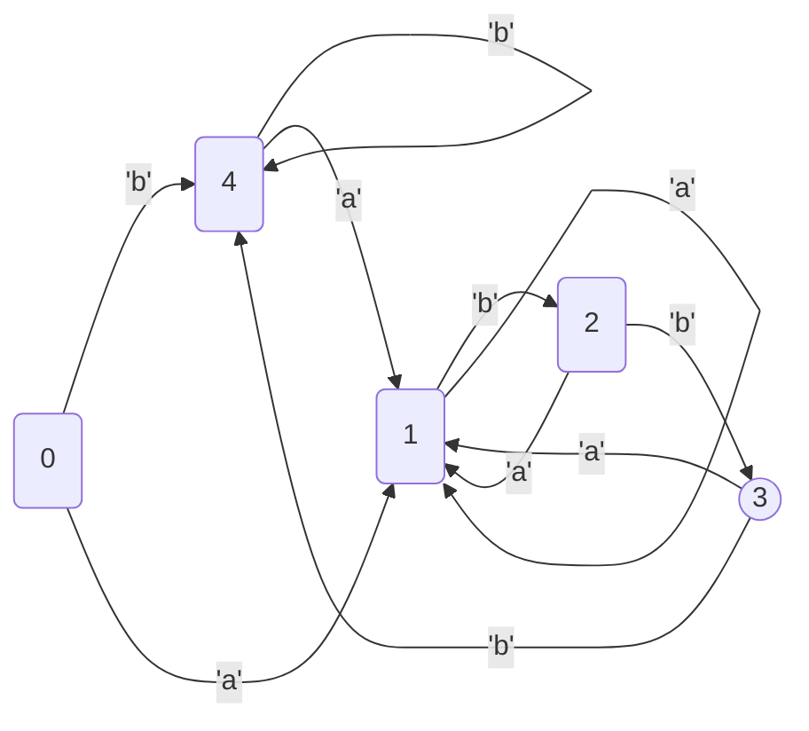
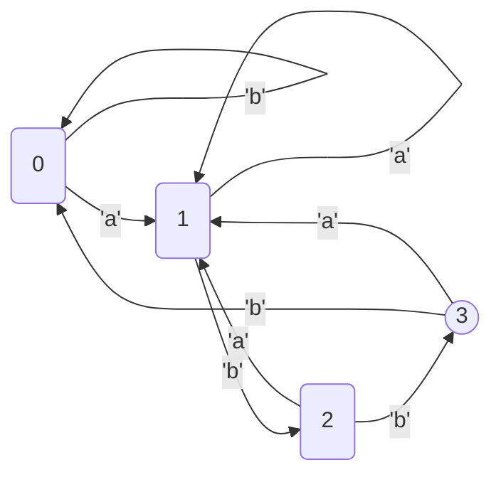

# JRegex

Regex Engine written by Java.

## build

```shell
mvn clean package -Dorg.slf4j.simpleLogger.defaultLogLevel=info
```

## Feature

* Regex => AST

```
RegexExp regexExp=RegexParser.parse("(a|b)*abb");
log.info(RegexExpTreeFormatter.format(regexExp));
```

```
[Concat]
├──[Repeat:*]
│  └──[Or]
│     ├──[Char:a]
│     └──[Char:b]
└──[Concat]
   ├──[Char:a]
   └──[Concat]
      ├──[Char:b]
      └──[Char:b]
```

* AST => NFA(thompson construction)

```
NFAGraph nfaGraph=NFAGraph.build(regexExp);
log.info(nfaGraph.toMermaidJsChart());
```

NFA Chart(using mermaid.js)



* NFA => DFA (Subset Construction)

```
DFAGraph dfa=nfa.toDFA();
log.info(dfa.toMermaidJsChart());
// state mappings
log.info(dfa.printStateMapping());
```

DFA Chart(using mermaid.js)



state mappings

```
<<<<<<<<<<<< NFA -> DFA >>>>>>>>>>>>>
s_0<==>(s_7,s_8,s_0,s_1,s_2,s_4)
s_4<==>(s_5,s_6,s_7,s_8,s_1,s_2,s_4)
s_1<==>(s_6,s_7,s_8,s_9,s_10,s_1,s_2,s_3,s_4)
s_2<==>(s_5,s_6,s_7,s_8,s_11,s_12,s_1,s_2,s_4)
s_3<==>(s_5,s_6,s_7,s_8,s_13,s_1,s_2,s_4)
```

* DFA minimization

```
DFAGraph minDfa=dfa.simplify();
log.info(minDfa.toMermaidJsChart());
// state mappings
log.info(minDfa.printStateMapping());
```

min DFA state(using mermaid.js)



state mappings

```
s_0<==>(s_0,s_4)
s_1<==>(s_1)
s_2<==>(s_2)
s_3<==>(s_3)
```

* NFA execution

```
void matches(){
    RegexExp regexExpression=RegexParser.parse("(a|b)*abb");
    NFAGraph nfa=NFAGraph.build(regexExpression);
    NFAGraphMatcher nfaGraphMatcher=new NFAGraphMatcher(nfa);
    Assertions.assertTrue(nfaGraphMatcher.matches("aaaaaaaaaaaaaaaaaaaaaabb"));
}
```

* DFA execution

```
void matches(){
    RegexExp regexExpression=RegexParser.parse("(a|b)*abb");
    NFAGraph nfa=NFAGraph.build(regexExpression);
    DFAGraph dfa=nfa.toDFA();
    DFAGraph minDfa=dfa.simplify();
    DFAGraphMatcher dfaGraphMatcher=new DFAGraphMatcher(minDfa);
    Assertions.assertTrue(dfaGraphMatcher.matches("aaaaaaaaaaaaaaaaaaaaaabb"));
}
```

## Supported Syntax

- or `|`
- concat
- ()
- repeat
  - `*`
  - `+`
  - `?`
  - `{n,m}`
  - `{n}`
  - `{n,}`
- char group
  - `[]`
  - `[^]`
- char range
  - a-z
- single char(unicode char)
  - non-escaped char
  - escape char( escaped by `\`)
- meta char
  - \d \D  => [0-9]
  - \w \W  => [a-zA-Z0-9_]
  - \s \S  => [ \t\n\x0B\f\r]
  - . => [all chars]